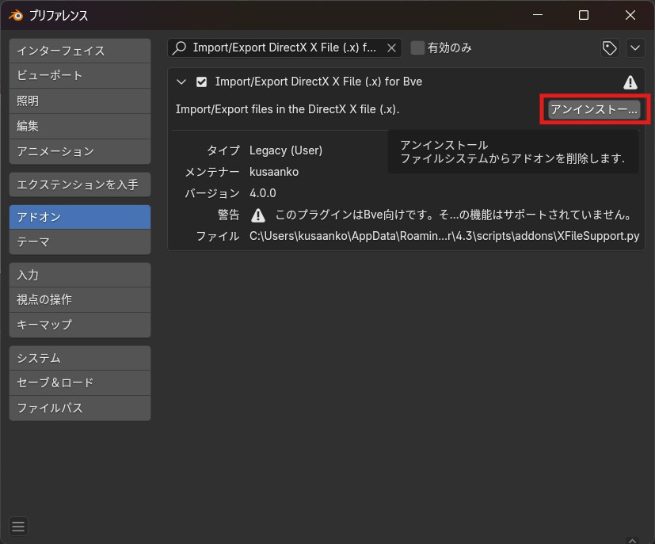

# XFileSupport_BVE
Bve用に設計されたBlender用のXファイル入出力アドオン

Blender Extensions (https://extensions.blender.org/add-ons/bve-import-export/) から入手できます

CSV出力にも対応しています。また、OpenBVE専用のCSV機能にも対応します。

対応Blenderバージョン:4.3.0以降  
動作確認Bveバージョン:5.8, 6.0  
strview5互換あり  
csvview5互換あり  

# 対応しているXファイルの機能 
* 頂点
* 面
* 法線(インポート時には使用されません)
* マテリアル
* テクスチャ
* テキスト、バイナリ形式、バイナリ圧縮形式
* Frame

# 対応しているCSVファイルの機能
* 全て

# 対応しているBlenderの機能
* マテリアル
  * ノード未使用時の色
  * プリンシプルBSDFノード
  * テクスチャノード
  * ベースカラー
  * アルファ
  * 放射
  * ガンマ
* フラットシェード、スムースシェード
* モディファイアー(100％動作はしません。)

Blender Import / Export add-on for Bve

Exporting to CSV is also supported. Some OpenBVE features are supported.

Supported Blender version:4.3.0 or later  
Tested Bve versions:5.8, 6.0  
strview5 tested  
csvview5 tested  

# Supported x file features
* Vertices
* Faces
* Normals (Not used when import)
* Material
* Texture
* Text, binary and zipped-binary file format
* Frame

# Supported csv file features
* All

# Supported Blender features
* Material
  * Color without nodes
  * Precinple BSDF nodes
  * Texture nodes
  * Base color
  * Alpha
  * Emission
  * Gamma
* Flat shade and Smooth shade
* Modifier ( Doesn't work completely )

# 使い方・注意点
Wikiページを御覧ください。[Wiki](https://github.com/kusaanko/XFileSupport_BVE/wiki)

# インストール方法
</img>  
編集>プリファレンスをクリックして設定画面を出します  
</img>  
エクステンションを入手へ移動します。

検索欄に「BVE」と入力し、BVE Import/Exportをインストールしてください。

## アドオン版を利用の方
新たにBlenderエクステンション版としてリリースしたため、アドオン版を利用していた方（ver 5.0.0より前のバージョン）は削除する必要があります。

</img>  
プリファレンス→アドオンから「DirectX」と検索すると以前のバージョンのアドオンが出てきます。

右側にあるアイコンをクリックして展開し、アンインストールボタンをクリックしてください。

# ビルド / Build

```
blender --command extension build --output-dir ../out
```

# 開発 / Development
bpyパッケージを導入したvenv環境下で補完を利かせながら開発することをお勧めします。

```
python -m venv .venv
./.venv/Scripts/activate
pip install bpy
```

# ToDo
- CSV入力のサポート
