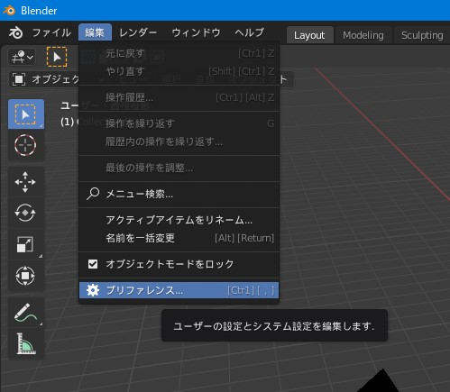
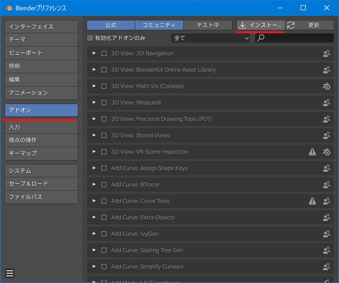
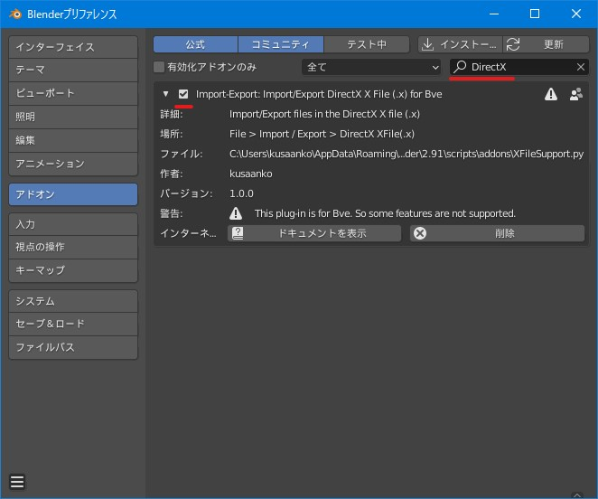

# Blender_XFileSupport_BVE
 Bve用に設計されたBlender用のXファイル入出力プラグイン

# インストール方法
</img>  
編集>プリファレンスをクリックして設定画面を出します  
</img>  
アドオン->インストールをクリックします  
</img>  
ダウンロードしたXFileSupport.pyを選択してアドオンをインストールをクリックします。
</img>  
「DirectX」と検索してこのプラグインが有効になっていることを確認してください。